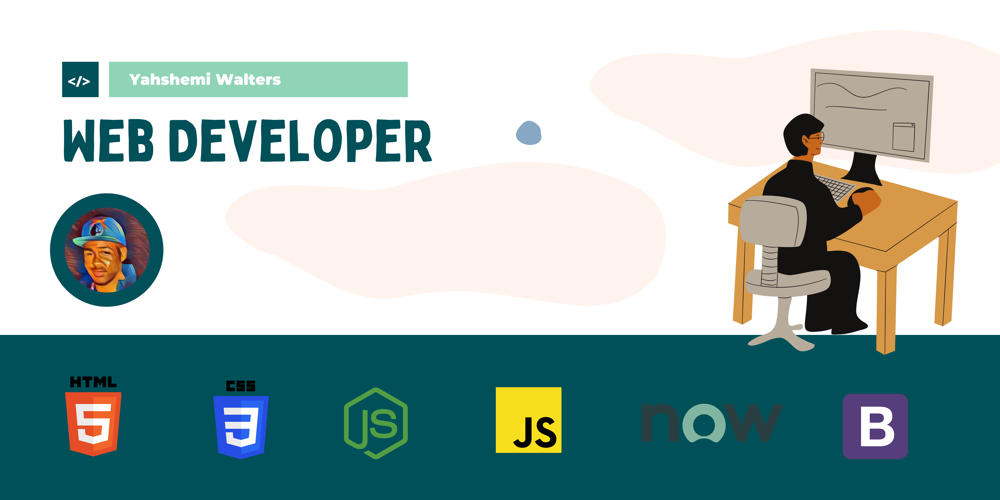

### Hi there, I'm Yahshemi👋

- 🌱 I’m currently learning Service Now
- ⚡ Fun fact: I'm into photography and music.

<!--

**Yahshemi/Yahshemi** is a ✨ _special_ ✨ repository because its `README.md` (this file) appears on your GitHub profile.

Here are some ideas to get you started:

- 🔭 I’m currently working on 
- 👯 I’m looking to collaborate on ...
- 🤔 I’m looking for help with ...
- 💬 Ask me about ...
- 📫 How to reach me: ...
- 😄 Pronouns: ...
-->
